# Project-102-CryptoCovid_ML

----

---- 

## Bitcoin price prediction in the time of COVID-19 and the effect of this event on Bitcoin price movement in the future!

----

### We want to collect data for 2 periods from online open sources: 

- First period: from July 1st, 2020 to July 31st, 2021

    (07/01/2020 - 05/31/2021) Training Data ; 
    (05/01/2021 - 07/31/2021) Testing Data

- Second period: from January 1st, 2021 to July 1st, 2022

    (01/01/2021 - 02/31/2022) Training Data ; 
    (03/01/2022 - 07/01/2021) Testing Data

In this Project, We want to use historical Bitcoin data, Twitter data, and COVID-19 data to compare the performance of four different Machine Learning Models to predict Bitcoin price trend.

> I want to use the data as four different features sets: 

    (1) Historical Bitcoin exchange data;

    (2) Historical Bitcoin exchange data + COVID-19 data (accumulated confirmed Covid-19 Cases, accumulated Covid-19 death);

    (3) Historical Bitcoin exchange data + Twitter data;

    (4) Historical Bitcoin exchange data + COVID-19 data (accumulated confirmed Covid-19 Cases, accumulated Covid-19 death) + Twitter data.

> Using Random forest machine learning models with the features above we want to see if they will help us have a better prediction of the future prices of bitcoin!

# Bitcoin price over the course of last three years!

   

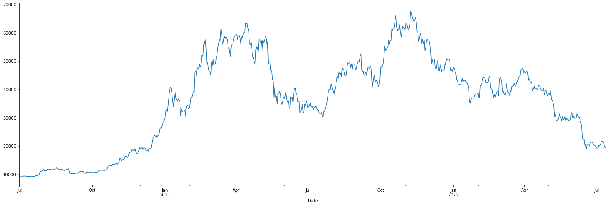

>> Collecting data from WHO we able to filter out how covid cases and deaths are around the globe and select the total change in cumulative cases and deaths only for 8 countries which are the countries that hold the most bitcoin and see if that feature will effect the price and see if there it is helpful in predicting the price movement.

> Countries that hold the most bitcoin by volume are: 

        * INDIA
        * SOUTH KOREA
        * BRAZIL
        * SPAIN
        * UNITED STATES OF AMERICA
        * MEXICO
        * GERMANY
        * CHINA

> Cumulative Covid-19 cases: 

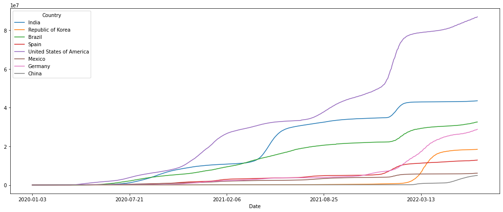 

> Cumulative Covid-19 deaths:

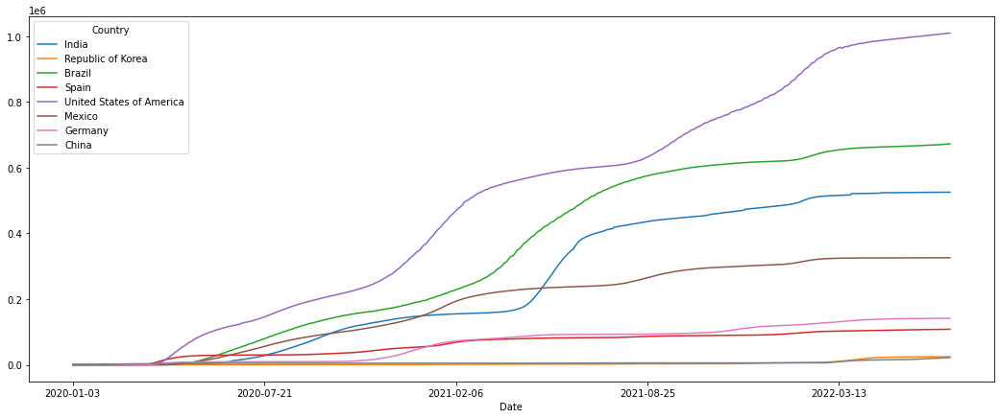

# The first period of this analysis is from July 1st 2020 to July 31st 2021 and we are using Random Forest to predict the bitcoin price:

> Click here to see the first model ["1st Model without features](1st_ML_model_withoutfeatures.ipynb)

> Price Prediction for the first period using just bitcoin Data

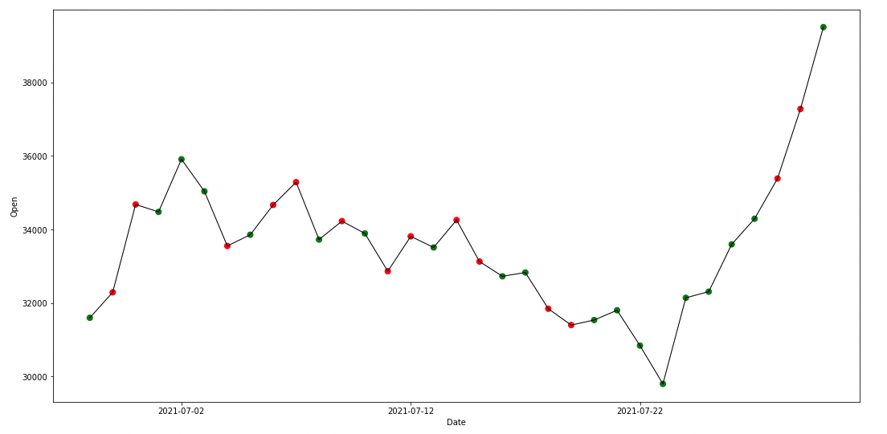

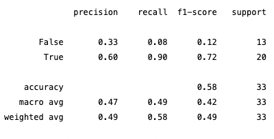

> Click here to see the second model ["2st Model with features](2nd_ML_model_withfeatures.ipynb)

> Price Prediction for the first period using bitcoin Data with added features with *(from ta import add_all_ta_features)* library

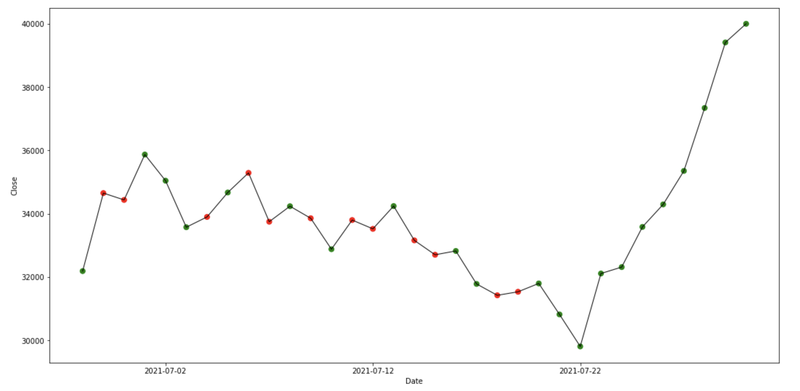

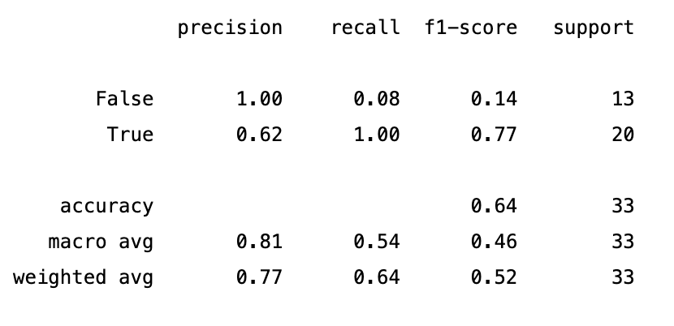

> Click here to see the 3rd model ["3rd Model with bitcoin data and tweeter sentiment analysis](3rd_ML_model_using_btc_tweeter.ipynb)

> Price Prediction for the first period using just bitcoin Data and tweeter sentiment analysis

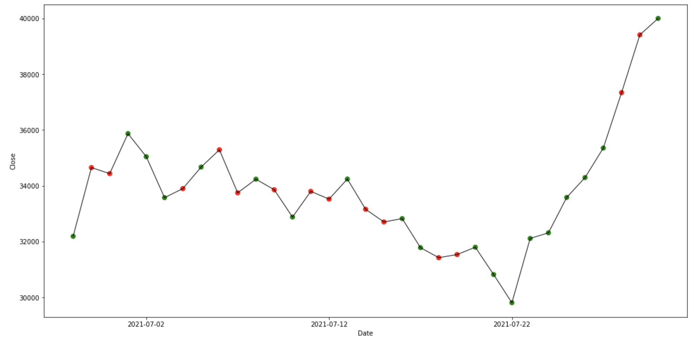

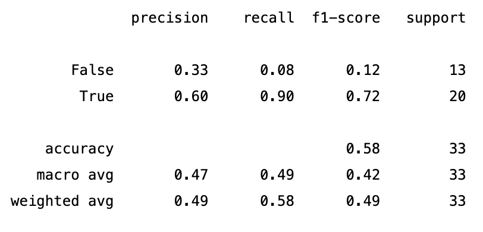

> Click here to see the model with all features together ["1st period Model with bitcoin data, added features, tweeter sentiment analysis, covid cases and death for 8 countries that hold the most bitcoin by volume](1st_covid_period.ipynb)

> Price Prediction for the first period using bitcoin data, added features, tweeter sentiment analysis, covid cases and death for 8 countries that hold the most bitcoin by volume

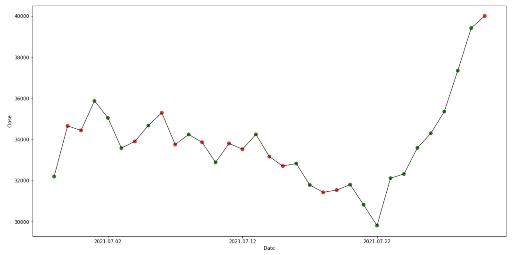

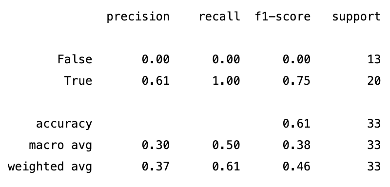